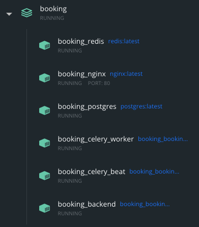

## 0. About

**Booking** is a simple async API using FastAPI, Pydantic V2, SQLAlchemy 2.0 and PostgreSQL:

- [`FastAPI`](https://fastapi.tiangolo.com)
- [`Pydantic V2`](https://docs.pydantic.dev/2.4/)
- [`SQLAlchemy 2.0`](https://docs.sqlalchemy.org/en/20/changelog/whatsnew_20.html)
- [`Celery`](https://docs.celeryq.dev/en/stable/)
- [`PostgreSQL`](https://www.postgresql.org)
- [`Redis`](https://redis.io)
- [`Docker Compose`](https://docs.docker.com/compose/)
- [`NGINX`](https://nginx.org/en/)

## 1. Contents

0. [About](#0-about)
1. [Contents](#1-contents)
2. [Prerequisites](#2-prerequisites)
3. [Run using docker compose](#3-run-using-docker-compose)
4. [Run without docker](#4-run-without-docker)

## 2. Prerequisites

Clone this repository 
```sh
git clone https://github.com/Toffery/booking.git
```

Create `.env`, `.docker.env` `.test.env` in the root directory of the project and `/path/to/project/auth/.env` files. The `.env` file will be used when running with `python3 src/main.py`, `.docker.env` will be used when running with `docker-compose-all.yml`, `.test.env` will be used when testing.

The project structure will look like this (assuming booking is the root directory of the project):

```sh
booking
├── migrations/
│   ├── ...
├── src/
│   ├── auth/
│      ├──  __init__.py
│      ├── .env <--- add this
│      ├── .env.example
│      ├── ...
│   ├── bookings/
│   ├── ...
├── tests/
│   ├── ...
├── ...
├── .docker.env <--- add this
├── .env <--- add this
├── .env.example
├── ...
├── .test.env <--- and add this
├── .test.env.example
└── ...
```

Fill them according to the example files or look at the example below:

```
# .env
MODE = LOCAL (in remote server use PROD)

DB_NAME = booking
DB_HOST = localhost (in remote server use booking_postgres)
DB_USER = <postgres_user_name>
DB_PASS = <postgres_user_pass>
DB_PORT = 5432

REDIS_HOST = localhost (in remote server use booking_redis)
REDIS_PORT = 6379

-----------
# .docker.env
MODE = DEV

DB_NAME = booking
DB_HOST = booking_postgres
DB_USER = <postgres_user_name>
DB_PASS = <postgres_user_pass>
DB_PORT = 5432

REDIS_HOST = booking_redis
REDIS_PORT = 6379

-----------
# .env.test
MODE = TEST

DB_NAME = test_booking
DB_HOST = localhost
DB_USER = <postgres_user_name>
DB_PASS = <postgres_user_pass>
DB_PORT = 5432

REDIS_HOST = localhost
REDIS_PORT = 6379

-----------
# /path/to/the/project/src/auth/.env
JWT_SECRET = <jwt-secret> # opensll rand -hex 32
JWT_ALG = HS256
ACCESS_TOKEN_EXP_MINUTES = 30
REFRESH_TOKEN_EXP_DAYS = 30
```

## 3. Run using docker-compose

Make sure you installed `Docker` on your machine. The best way is to install `Docker Desktop` using [official guide](https://docs.docker.com/desktop/).

Create `docker network`:

```sh
docker network create my-network
```

Now to run all services in one command use `docker-compose-all.yml` file:

```sh
docker compose -f docker-compose-all.yml up -d
```

 It will run:
- **FastAPI app** (booking_backend)
- **Celery worker** (booking_celery_worker)
- **Celery beat** (booking_celery_beat)
- **Redis** (booking_redis)
- **PostgreSQL** (booking_postgres)
- **Nginx** (booking_nginx)

In Docker-Desktop you will see:



Now you can access to the `FastAPI` app through `Nginx` on `localhost`.

To see the logs of containers type in terminal:

```sh
docker logs <container_name>
```

For example, to see the logs of `FastAPI` app:

```sh
docker logs booking_backend
```

Optionall you can pass `--follow` for live updating:

```sh
docker logs --follow booking_backend
```

## 4. Run without Docker

If you don't want to user `Docker`, follow the next steps:

1. Make sure PostgreSQL and Redis is running:

    MacOS:
    ```sh
    brew install postgresql
    brew services start postgresql
    # for stopping use:
    # brew services stop postgresql 

    brew install redis
    brew services start redis
    # for stopping use:
    # brew services stop redis
    ```

    For more information go to [Postgresql](https://www.postgresql.org/download/macosx/) and [Redis](https://redis.io/docs/latest/operate/oss_and_stack/install/install-redis/install-redis-on-mac-os/).

    For Linux: [Postgresql](https://www.postgresql.org/download/linux/), [Redis](https://redis.io/docs/latest/operate/oss_and_stack/install/install-redis/install-redis-on-linux/).

2. Create a 'booking' table and 'test_booking' table for running tests. You can do it using, for example, [DBeaver](https://dbeaver.io/), or via command-line:

    ```sh
    psql -h localhost -p 5432 -U postgres
    create database booking;
    create database test_booking;
    \q
    ```

    You can change the names of databases, but don't forget to change .env file.
    
3. Follow [Prerequisites](#2-prerequisites). Make sure you created all .env files.

4. Create virtual env and install necessary dependencies. Run following commands in the root directory of the project:

    ```sh
    python3 -m venv venv
    source ./venv/bin/activate
    python3 -m pip install -r requirements.txt
    ```

5. Make migrations using `Alembic`:

    ```bash
    alembic upgrade head
    ```

6. Now you're ready to start. Run the following commang in the root directory of the project:

    ```bash
    python3 src/main.py
    ```

    API is available on `0.0.0.0:8000`.